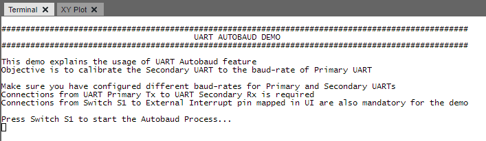
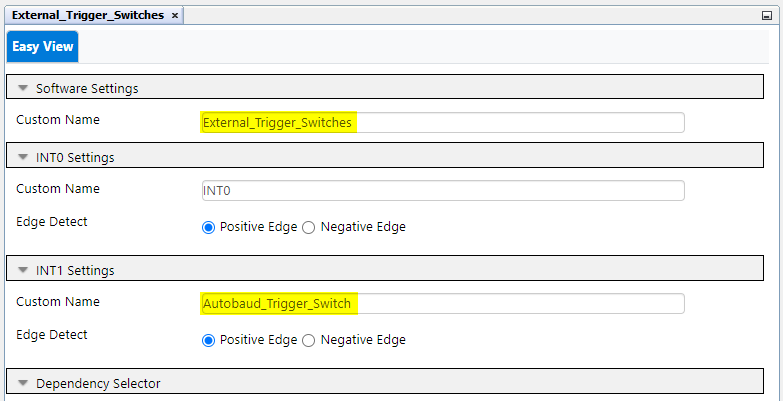

 

## dspic33ck curiosity uart autobaud demo

## Summary

The project demonstrates the usage of UART Autobaud feature and how in realtime the Primary UART tunes the Secondary UART to its baudrate.
We make use of dsPIC33CK Curiosity Development Board and configure the peripherals using MPLAB® Code Configurator.

## Related Documentation

[dsPIC33CK256MP508 datasheet](https://www.microchip.com/dsPIC33CK256MP508) for more information or specifications

## Software Used 
- [MPLAB® X IDE v6.05](https://www.microchip.com/mplabx) or newer
- [MPLAB® XC16 v2.10](https://www.microchip.com/xc16) or newer
- Device Family Pack: dsPIC33CK-MP_DFP v1.9.228
- [MPLAB® Code Configurator (MCC) 5.3.0](https://www.microchip.com/mcc) or newer Version: 
- Data Visualizer or any other serial terminal with the following settings

## Hardware Used
- [dsPIC33CK Curiosity Board](https://www.microchip.com/dm330030)

## Setup
**Hardware Setup**
- Connect a micro-USB cable to port `J7` of Curiosity board to USB port of PC
- Connect a jumper wire from UART1_Tx (RD8) -> UART2_Rx (RD12)
- Connect a jumper wire from Board Switch S1 (RE7) -> Mapped external interrupt PIN (RD15) 

 

**Serial Port Setup**
- Open a serial terminal with the following configurations  

**MPLAB® X IDE Setup**
- Open the `dspic33ck-curiosity-uart-autobaud-demo.X` project in MPLAB® X IDE
- Build and program the device

## Operation
- On programming the device, the Terminal prompts the user to check the connections and baudrates of both the UARTs.
- Following which it asks a confirmation by asking user to press Switch S1 to start the Autobaud process. 
   
- Device prints the initial baudrates of the UART Primary and UART Secondary peripherals as 9600 and 115200 as per configuration in MCC.
- UART Primary Transmitter U1TX then starts the autobaud process by sending the 0x55 ie; the ASCII character 'U' to the UART Secondary U2RX
- Upon success of the autobaud process, the notification LED Green will be indicated. Followed by a message on terminal.  
   
- If failure occurs, user gets the option to check the connections and retry again by pressing the Switch S1 with an LED Red notification to indicate failiure of process. 
   

## MCC Configurations
- UART1 Configuration :  

- UART2 Configuration :  
 
- UART3 Configuration :  
 
 > UART Pin Configuration  
 UART1TX - RD8 & UART1RX - RD7 
 UART2TX - RD9 & UART2RX - RD12 
 UART3TX - RD4 & UART3RX - RD3 
 

- External Interrupt Configuration :  

 > External Interrupt Pin Configuration  
 INT1 - RD1 
 Switch_S1 - RE7
 

- Pins Configuration :  
 

